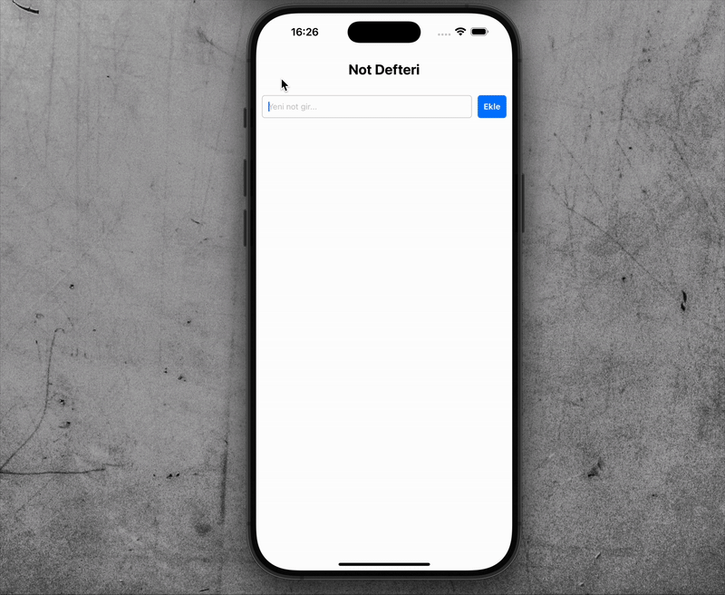

# 📝 Not Defteri Uygulaması

React Native ile geliştirilmiş basit bir not defteri uygulamasıdır.  
Kullanıcılar not ekleyebilir, listeleyebilir ve silebilir. Uygulama, notları cihazda kalıcı olarak saklar (AsyncStorage).

## ✨ Özellikler

- ✏️ Yeni not ekleme
- 📋 Notları listeleme
- 🗑️ Not silme
- 💾 Verileri kalıcı olarak saklama (AsyncStorage)

---

## 📸 Screen Giif

